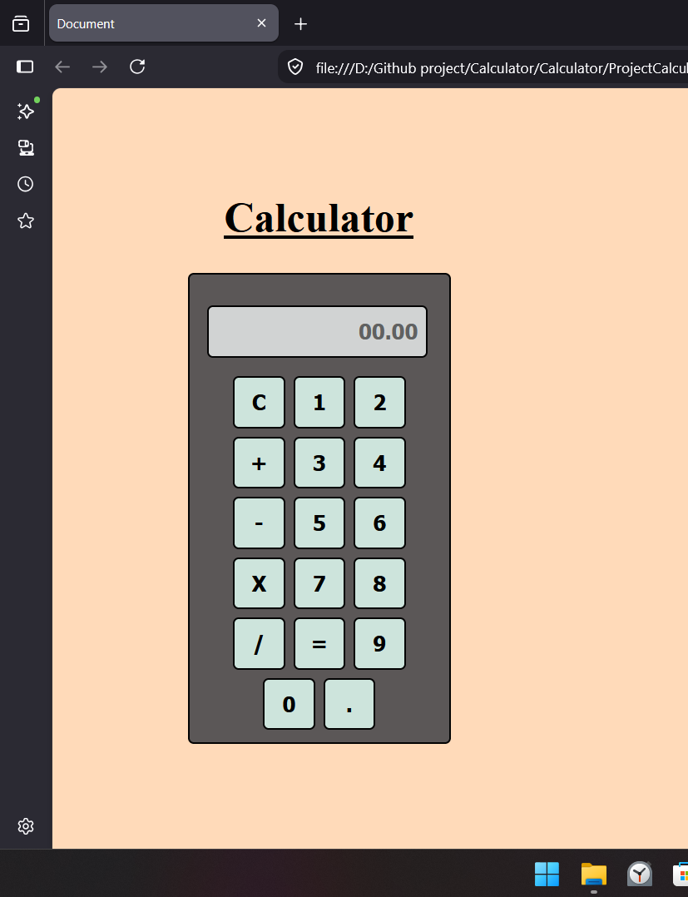

# 🧮 Simple Calculator

A responsive and user-friendly calculator built using **HTML**, **CSS**, and **JavaScript**. It performs basic arithmetic operations with a clean and modern interface.

## 🚀 Features

- ➕ Addition
- ➖ Subtraction
- ✖️ Multiplication
- ➗ Division
- 🧹 Clear display
- 🖥️ Responsive design
- ⚡ Instant calculation

## 🛠️ Technologies Used

- HTML5
- CSS3
- JavaScript (ES6)

## 📂 Project Structure

```
Simple-Calculator/
│── ProjectCalculator.html
│── Project2.css
│── Project2.js
└── README.md
```

## 📸 Preview



## 💡 How to Run

1. Clone this repository:
   ```bash
   git clone https://github.com/your-username/Simple-Calculator.git
   ```

2. Open the project folder.

3. Run `ProjectCalculator.html` in your web browser.

## Learning Outcomes

This project helped me practice:

- HTML structure
- CSS styling and layouts
- DOM Manipulation
- JavaScript Event Handling
- Arithmetic operations using JavaScript

## Future Improvements

- Keyboard support
- Scientific calculator functions
- Calculation history
- Dark/Light mode
- Improved error handling

## Contributing

Contributions, suggestions, and improvements are welcome.


---

⭐ If you found this project helpful, consider giving it a star!